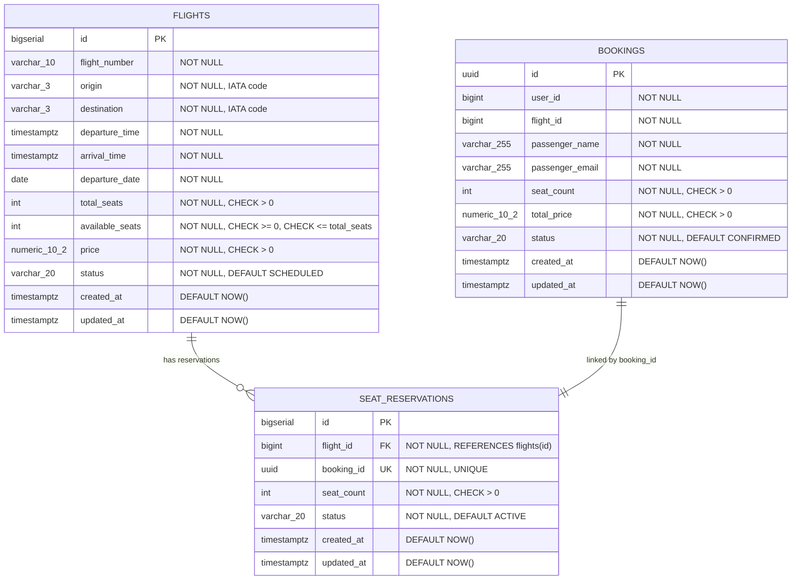

# ER диаграмма

```mermaid
erDiagram
    FLIGHTS {
        bigserial id PK
        varchar_10 flight_number "NOT NULL"
        varchar_3 origin "NOT NULL, IATA code"
        varchar_3 destination "NOT NULL, IATA code"
        timestamptz departure_time "NOT NULL"
        timestamptz arrival_time "NOT NULL"
        date departure_date "NOT NULL"
        int total_seats "NOT NULL, CHECK > 0"
        int available_seats "NOT NULL, CHECK >= 0, CHECK <= total_seats"
        numeric_10_2 price "NOT NULL, CHECK > 0"
        varchar_20 status "NOT NULL, DEFAULT SCHEDULED"
        timestamptz created_at "DEFAULT NOW()"
        timestamptz updated_at "DEFAULT NOW()"
    }

    SEAT_RESERVATIONS {
        bigserial id PK
        bigint flight_id FK "NOT NULL, REFERENCES flights(id)"
        uuid booking_id UK "NOT NULL, UNIQUE"
        int seat_count "NOT NULL, CHECK > 0"
        varchar_20 status "NOT NULL, DEFAULT ACTIVE"
        timestamptz created_at "DEFAULT NOW()"
        timestamptz updated_at "DEFAULT NOW()"
    }

    BOOKINGS {
        uuid id PK
        bigint user_id "NOT NULL"
        bigint flight_id "NOT NULL"
        varchar_255 passenger_name "NOT NULL"
        varchar_255 passenger_email "NOT NULL"
        int seat_count "NOT NULL, CHECK > 0"
        numeric_10_2 total_price "NOT NULL, CHECK > 0"
        varchar_20 status "NOT NULL, DEFAULT CONFIRMED"
        timestamptz created_at "DEFAULT NOW()"
        timestamptz updated_at "DEFAULT NOW()"
    }

    FLIGHTS ||--o{ SEAT_RESERVATIONS : "has reservations"
    BOOKINGS ||--|| SEAT_RESERVATIONS : "linked by booking_id"
```